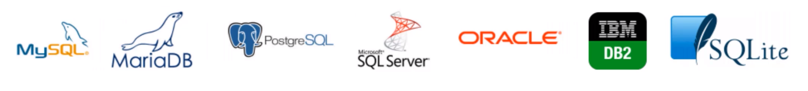

# Modelagem de Dados

## Sumário

- [Conceitos Introdutórios](#Conceitos-Introdutórios)

- [Transformando dados do universo do discurso para o modelo de dados representativo](#Transformando-dados-do-universo-do-discurso-para-o-Modelo-de-Dados-Representativo)
  - [Passo a passo para a transformação](#Passo-a-passo-para-a-transformação)
  - [Resumo da transformação do universo do discurso para o modelo de dados nível representativo](#Resumo-da-transformação-do-universo-do-discurso-para-o-modelo-de-dados-nível-representativo)
  - [1 Como fazer o Levantamento e Análise de Requisitos](#1-Como-fazer-o-Levantamento-e-Análise-de-Requisitos)
  - [2 Como fazer o Projeto Conceitual ou Modelo ER](#2-Como-fazer-o-Projeto-Conceitual-ou-Modelo-ER)

## Conceitos Introdutórios

- **Banco de Dados**: *Coleção* logicamente coerente de dados relacionados, que representa algo do mundo real (universo do discurso ou minimundo) e é projetado para uma finalidade específica.
- **Sistema de Gerenciamento de Banco de Dados (SGBD)**:  *Software* de uso geral que permite:   
  - *definir* tipos, estruturas e restrições (formando um conjunto chamado metadados), 
  - *construir* (armazenar os dados em algum meio), 
  - *manipular* (consultar, atualizar ou recuperar dados) e 
  - *compartilhar* bancos de dados.

Os mais utilizados são:




- **Sistemas de Bancos de Dados**: A união da *coleção* com o *software*.


- **Abstração de dados**: É o que permite a supressão entre os dados organizados e os efetivamente armazenados. Afinal, é preferível que seja armazenado apenas o que é útil ao usuário, certo?

- **Entidades:** É o motivo do banco de dados, aquilo que precisa ter suas informações armazenadas e manipuladas, como "aluno" para uma escola, "funcionário" para uma empresa, "livro" para uma biblioteca...

- **Atributos:** São as características das Entidades. No exemplo de alunos para uma escola, alguns atributos seriam "nome", turno" ou "turma".

- **Relacionamento:** É sempre associado a um verbo: O aluno "estuda" a noite, o livro "é" de ficção.

- **Modelos de Alto Nível**: É como o usuário vê, é o mais próximo dele. Utilizam as entidades, atributos e relacionamentos.

- **Modelos de Baixo Nível**: Traz, além de tudo, detalhes de como os dados são armazenados no computador e é mais para uso dos DBAs. Acessa a estrutura, mostrando em quais arquivos, em que computador, qual tamanho do registro, em que disco está localizado... tudo isso.

- **Modelos de Dados Representativos (de relacionamento, relacionais)**: é um esquema gráfico que é o meio do caminho entre os dois últimos. Suprimem alguma coisa, mas ainda são próximos do baixo nível. Existem as entidades, atributos e relacionamentos, assim como no modelo alto nível, **mas são trabalhados com a linguagem SQL**. 

  

- **Esquema do Banco de Dados:** É onde ficam definidas as entidades e seus atributos. É definido no início do projeto e espera-se que não mude. 

  Num banco de dados de aluno, o esquema seria:

  ```js 
  ALUNO:
  
  nome - numero-do-aluno - turno - serie
  ```

- **Evolução do esquema**: Acontece quando há uma mudança no esquema do banco de dados.

- **Estado do Banco de Dados (snapshot)**: Muda com frequência, a cada alteração do banco. No começo, ele está em "estado vazio", passando posteriormente a "estado inicial" -> "estado atual 1" -> "estado atual 2" -> "estado atual 3" -> [...].

  O SGBD precisa garantir que todos os estados depois do estado inicial sejam estados válidos.

## Transformando dados do universo do discurso para o modelo de dados representativo

### Passo a passo para a transformação

Esses são os passos para criar um modelo de dados representativo, a partir do minimundo. Para isso, precisamos passar no modelo de dados alto nível. A parte que importa, por enquanto, são os números 1, 3 e 4. Os outros constam a título de curiosidade:

| nº   | Entrada                                                      | Nome do Processo                                             | Saída                                                        |
| ---- | ------------------------------------------------------------ | ------------------------------------------------------------ | ------------------------------------------------------------ |
| 1    | Levantamento minucioso de tudo o que pode ser relevante no Modelo de Alto Nível (aquilo que será mostrado ao usuário). | **Levantamento e Análise de Requisitos**                     | - Requisitos Funcionais;  - Requisitos de Dados.             |
| 2    | Requisitos Funcionais                                        | **Análise Funcional** (usando diagrama de fluxo de dados, de cenários, de sequência...) | - Relatório de transações no modelo alto nível.              |
| 3    | Requisitos de Dados                                          | **Análise Conceitual**                                       | - Projeto Conceitual (ou Modelo ER) em modelo alto nível: descrição gráfica de entidades, relacionamentos e restrições. |
| 4    | Esquema Conceitual                                           | **Projeto Lógico (Mapeamento do Modelo de Dados**)           | - Esquema Lógico ou Conceitual, mas agora no modelo de Dados Representativo do SGBD. |
| 5    | Esquema Lógico + Relatório de Transações Alto Nível          | **Projeto Físico**                                           | - Esquema Interno                                            |
| 6    | Esquema Interno + Projeto do Programa de Aplicação (transações alto nível formatadas pelo SGBD) | **Implementação da Transação**                               | - Programas de Aplicação                                     |

É importante destacar que, mesmo não sendo o foco no momento, o SGBD pode traduzir as especificações alto nível que vieram da Análise Funcional para o chamado "Projeto do Programa de Aplicação".

#### Resumo da transformação do universo do discurso para o modelo de dados nível representativo

- Universo do discurso (minimundo) --> 

  --> { Levantamento e Análise de Requisitos } --> Requisitos de Dados --> { Análise Conceitual } --> 

- Projeto Gráfico Conceitual Alto Nível (Modelo ER)

  --> { Projeto Lógico } --> 

- Esquema Lógico no modelo de dados representativo

#### 1 Como fazer o Levantamento e Análise de Requisitos

Reuniões e análises minuciosas.

#### 2 Como fazer o Projeto Conceitual ou Modelo ER

Depois de ter registrados todos os requisitos de dados, ou seja, todo o tipo de dado que precisa estar no projeto, é preciso transformar isso num Modelo de Dados Alto Nível. Para fazer isso, fazemos o **projeto conceitual**, que pode ser chamado também de Modelo ER.