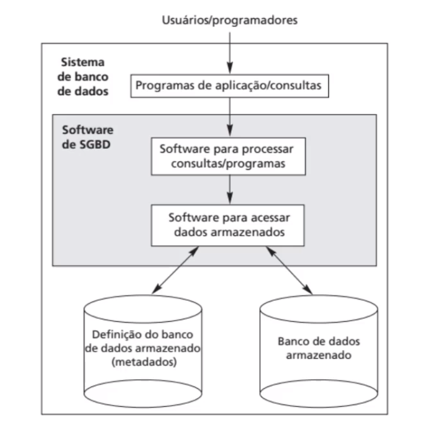
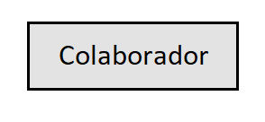
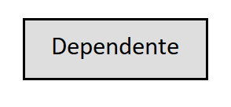
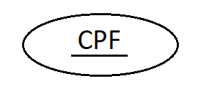
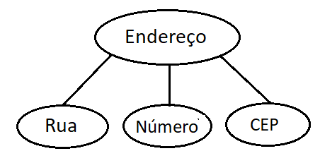
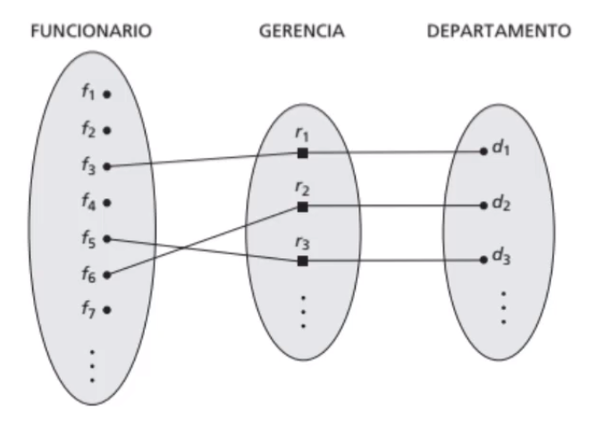
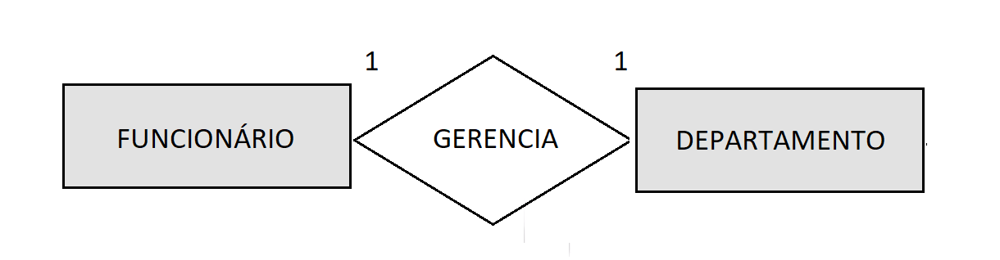

# Modelagem de Dados

## Sumário

- [Conceitos Introdutórios](#Conceitos-Introdutórios)

- [Transformando dados do universo do discurso para o modelo de dados representativo](#Transformando-dados-do-universo-do-discurso-para-o-Modelo-de-Dados-Representativo)
  
  - [Passo a passo para a transformação](#Passo-a-passo-para-a-transformação)
    - [Resumo do passo a passo](#Resumo-do-passo-a-passo)
  
  - [Fazendo o Modelo Conceitual ou Modelo ER](#Fazendo-o-Modelo-Conceitual-ou-Modelo-ER)
    - [Entidades e Atributos](#Entidades-e-Atributos)
    - [Relacionamentos](#Relacionamentos)

## Conceitos Introdutórios

> Aula 1 do curso _Modelagem de banco de dados relacional: Entidades, relacionamentos e atributos_: SGBD.

- **Banco de Dados**: *Coleção* logicamente coerente de dados relacionados, que representa algo do mundo real (universo do discurso ou minimundo) e é projetado para uma finalidade específica.
- **Sistema de Gerenciamento de Banco de Dados (SGBD)**:  *Software* de uso geral que permite:   
  - *definir* tipos, estruturas e restrições (formando um conjunto chamado metadados), 
  - *construir* (armazenar os dados em algum meio), 
  - *manipular* (consultar, atualizar ou recuperar dados) e 
  - *compartilhar* bancos de dados.

Os mais utilizados são:


- **Sistemas de Bancos de Dados**: A união da *coleção* com o *software*.



- **Abstração de dados**: É o que permite a supressão entre os dados organizados e os efetivamente armazenados. Afinal, é preferível que seja armazenado apenas o que é útil ao usuário, certo?

- **Entidades:** É o motivo do banco de dados, aquilo que precisa ter suas informações armazenadas e manipuladas, como "aluno" para uma escola, "funcionário" para uma empresa, "livro" para uma biblioteca...

- **Atributos:** São as características das Entidades. No exemplo de alunos para uma escola, alguns atributos seriam "nome", turno" ou "turma".

- **Relacionamento:** É sempre associado a um verbo: O aluno "estuda" a noite, o livro "é" de ficção.

- **Modelos de Alto Nível**: É como o usuário vê, é o mais próximo dele. Utilizam as entidades, atributos e relacionamentos.

- **Modelos de Baixo Nível**: Traz, além de tudo, detalhes de como os dados são armazenados no computador e é mais para uso dos DBAs. Acessa a estrutura, mostrando em quais arquivos, em que computador, qual tamanho do registro, em que disco está localizado... tudo isso.

- **Modelos de Dados Representativos (de relacionamento, relacionais)**: é um esquema gráfico que é o meio do caminho entre os dois últimos. Suprimem alguma coisa, mas ainda são próximos do baixo nível. Existem as entidades, atributos e relacionamentos, assim como no modelo alto nível, **mas são trabalhados com a linguagem SQL**. 

  

- **Esquema do Banco de Dados:** É onde ficam definidas as entidades e seus atributos. É definido no início do projeto e espera-se que não mude. 

  Num banco de dados de aluno, o esquema seria:

  ```js 
  ALUNO:
  
  nome - numero-do-aluno - turno - serie
  ```

- **Evolução do esquema**: Acontece quando há uma mudança no esquema do banco de dados.

- **Estado do Banco de Dados (snapshot)**: Muda com frequência, a cada alteração do banco. No começo, ele está em "estado vazio", passando posteriormente a "estado inicial" -> "estado atual 1" -> "estado atual 2" -> "estado atual 3" -> [...].

  O SGBD precisa garantir que todos os estados depois do estado inicial sejam estados válidos.

## Transformando dados do universo do discurso para o modelo de dados representativo

### Passo a passo para a transformação

> Aula 2 do curso _Modelagem de banco de dados relacional: Entidades, relacionamentos e atributos_: Entidades

Esses são os passos para criar um modelo de dados representativo, a partir do minimundo. Para isso, precisamos passar no modelo de dados alto nível. A parte que importa, por enquanto, são os números 1, 3 e 4. Os outros constam a título de curiosidade:

| nº   | Entrada                                                      | Nome do Processo                                             | Saída                                                        |
| ---- | ------------------------------------------------------------ | ------------------------------------------------------------ | ------------------------------------------------------------ |
| 1    | Levantamento minucioso de tudo o que pode ser relevante no Modelo de Alto Nível (aquilo que será mostrado ao usuário). | **Levantamento e Análise de Requisitos**                     | - Requisitos Funcionais;  - Requisitos de Dados.             |
| 2    | Requisitos Funcionais                                        | **Análise Funcional** (usando diagrama de fluxo de dados, de cenários, de sequência...) | - Relatório de transações no modelo alto nível.              |
| 3    | Requisitos de Dados                                          | **Análise Conceitual**                                       | - Projeto Conceitual (ou Modelo ER) em modelo alto nível: descrição gráfica de entidades, relacionamentos e restrições. |
| 4    | Esquema Conceitual                                           | **Projeto Lógico (Mapeamento do Modelo de Dados**)           | - Esquema Lógico ou Conceitual, mas agora no modelo de Dados Representativo do SGBD. |
| 5    | Esquema Lógico + Relatório de Transações Alto Nível          | **Projeto Físico**                                           | - Esquema Interno                                            |
| 6    | Esquema Interno + Projeto do Programa de Aplicação (transações alto nível formatadas pelo SGBD) | **Implementação da Transação**                               | - Programas de Aplicação                                     |

É importante destacar que, mesmo não sendo o foco no momento, o SGBD pode traduzir as especificações alto nível que vieram da Análise Funcional para o chamado "Projeto do Programa de Aplicação".

#### Resumo do passo a passo

- Universo do discurso (minimundo) --> 

  --> { Levantamento e Análise de Requisitos } --> Requisitos de Dados --> { Análise Conceitual } --> 

- Projeto Gráfico Conceitual Alto Nível (Modelo ER)

  --> { Projeto Lógico } --> 

- Esquema Lógico no modelo de dados representativo

### Fazendo o Projeto Conceitual ou Modelo ER

Depois de ter registrados todos os requisitos de dados, ou seja, todo o tipo de dado que precisa estar no projeto, é preciso transformar isso num Modelo de Dados Alto Nível. 

Para fazer isso, fazemos o **projeto conceitual**, que pode ser chamado também de Modelo ER. 

#### Entidades e Atributos

|            Elemento             |                        Característica                        |                           Exemplo                            | Representação Gráfica no Diagrama de Entidades e Relacionamentos |
| :-----------------------------: | :----------------------------------------------------------: | :----------------------------------------------------------: | :----------------------------------------------------------: |
|       **Entidade Forte**        |                    **Tem atributo chave**                    | **Um colaborador da empresa, que possui um número único de identificação.** |              |
|       **Entidade Fraca**        |                  **Não tem atributo chave**                  | **Um dos dependentes do plano de saúde deste colaborador.**  |         |
|         Atributo Chave          | É aquele atributo único para cada documento de uma entidade. | Número de CPF. Cada pessoa tem o seu único dentro da entidade "pessoas". |                   |
| **Atributo Simples ou Atômico** |              **Informação que não se divide.**               |                **Último nome de uma pessoa.**                |      |
|      **Atributo Composto**      |             **Pode ser dividido em subclasses.**             | **Endereço, que pode ser dividido em "Logradouro", "Cidade", "Estado", "CEP".** |    |
|     Atributo de Valor Único     |                   Só mostra uma resposta.                    |          A idade de uma pessoa ou seu último nome.           |      |
|     Atributo Multivalorado      |                  Pode ter várias respostas.                  |                Cursos feitos por uma pessoa.                 |    |
|     **Atributo Armazenado**     |                **É adicionado pelo usuário.**                |             **Ano de nascimento de uma pessoa**              |          **Não há representação gráfica especial.**          |
|      **Atributo Derivado**      |      **São levantados ou inferidos do próprio banco.**       |                 **Idade atual desta pessoa**                 |          **Não há representação gráfica especial**.          |
|         Atributo _null_         | 1 - Quando não sabemos o valor ou; 2 - o valor não é aplicável. | 1 - O endereço que ainda não conhecemos; 2 - O número de apartamento de uma pessoa que mora numa casa. |            Não há representação gráfica especial.            |

#### Relacionamentos

> Aula 3 do curso _Modelagem de banco de dados relacional: Entidades, relacionamentos e atributos_: Relacionamentos.

Relacionamentos são **ligações entre entidades**. É representado por um verbo. Graficamente, é representado por um losango. Mas, para fazer o esquema de levantamentos, pode exemplificar com os conjuntos mesmo.



##### Grau de relacionamento

É sempre o número de entidades que envolve. No relacionamento "trabalha em" dentro de uma empresa, ele é de grau 2, pois "colaborador trabalha em departamento". Para os fornecedores desta empresa, temos um relacionamento de grau 3: "**fornecedor** fornece uma **peça** a um **departamento**".

##### Nome de papéis

Perde um pouco de detalhes na tradução para o português, mas é um nome de expressa a realidade do minimundo em relação ao verbo. Exemplos são:

- "Trabalha em";
- "Fornece";
- "Supervisiona".

##### Relacionamentos Recursivos

Se duas entidades iguais se relacionam entre si, criamos dois universos, adicionamos no primeiro o nome da entidade e no segundo o nome do papel. Com os números 1 e 2 indicamos quem é o ativo na ação e quem sofre a ação. Exemplo:


##### Razão de Cardinalidade e Participação

É feita entre entidades, com o relacionamento no meio. São quatro casos:

1:1: Apenas uma entidade faz a ação na outra entidade. Exemplo: cada departamento de uma empresa fictícia só pode ter um gerente, e cada gerente só pode gerenciar um departamento.



1:N: O funcionário só pode ser vinculado a um departamento, mas cada departamento tem vários funcionários.


N:1: 

N:M: Uma entidade pode se relacionar com quantas quiser, e quem "recebe" a relação, pode receber também de várias vias. Exemplo: Um projeto de uma empresa pode "receber" vários funcionários, e cada funcionário, por sua vez, pode trabalhar em vários projetos.


